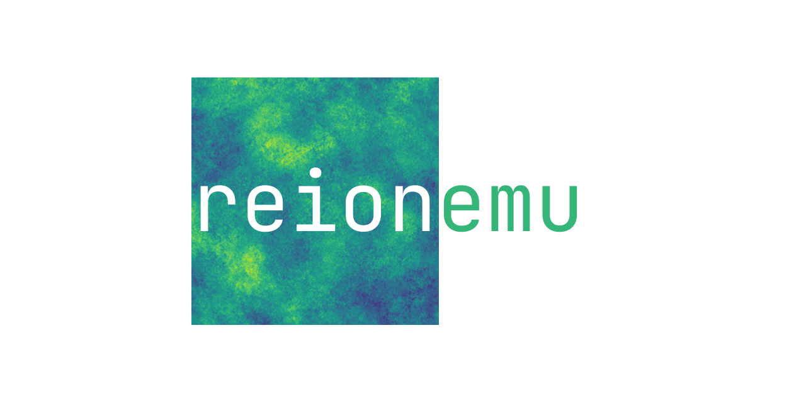

---
hide:
  - toc
---

  
  
Machine-learning emulator for reionization-era kSZ science

  <h1>A fast emulator for the kinetic Sunyaev-Zel'dovich power spectrum</h1>
  

    <code>reionemu</code> helps turn simulation outputs into trainable datasets, emulator models,
    and reusable workflows for exploring reionization parameter space without rerunning expensive simulations.
  

  

    <a class="md-button md-button--primary" href="getting-started/">Get Started</a>
    <a class="md-button" href="api-overview/">Browse API</a>
  

## What the package covers

  

    <h3>Simulation to dataset</h3>
    
Condense raw outputs, compute flat-sky power spectra, and assemble training-ready HDF5 datasets.

  

  

    <h3>Training workflows</h3>
    
Build dataloaders, train deterministic or MC-dropout emulators, and evaluate validation performance with reusable utilities.

  

  

    <h3>Search and tuning</h3>
    
Run Ray Tune experiments to explore architecture and optimizer choices for the deterministic four-parameter emulator.

  

## Start here

- [Getting Started](getting-started.md) outlines what to include for installation, verification, and contributor setup.
- [API Overview](api-overview.md) gives you a structure for documenting the public surface area.

## Repository layout

- Core package: `src/reionemu/`
- Scripts and HPC workflows: `scripts/`
- Research notebooks: `notebooks/`
- Documentation source: `docs/`
