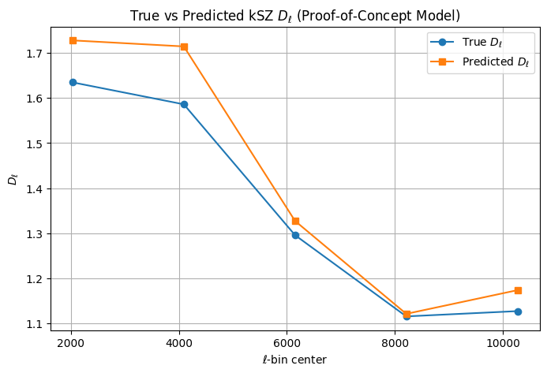
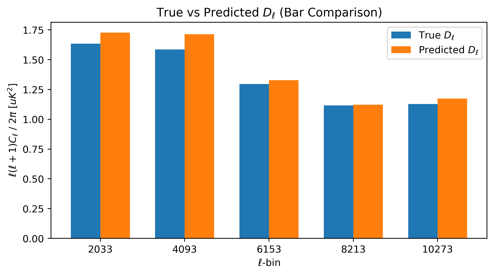
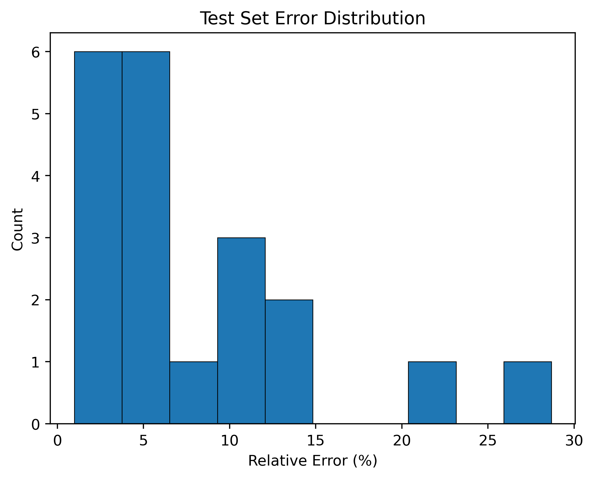

# src Directory

- **`__init__.py`**  
    Marks the **src** directory as a Python package.

- **`preprocessing.py`**  
    Loads processed simulation data, extracts parameters and spectra, applies a log transform to the binned power spectrum, and builds the final emulator dataset (**params**, **log(d_ell)**, **ell**).

- **`emulator.py`**  
    Defines the neural network architecture used to predict the kSZ angular power spectrum from reionization parameters.

- **`train.py`**  
    Trains the emulator using the prepared dataset, performs normalization, and saves the trained model weights and normalization statistics.

- **`evaluate.py`**  
    Loads the trained model and normalization stats, evaluates performance on the test set, computes accuracy metrics, and plots true vs. predicted spectra.

## Current Metrics

### Proof-of-Concept Model
The following figures summarize the performance of the proof-of-concept kSZ emulator on held-out test simulations.

#### True vs Predicted Line Comparison
The emulator captures the overall shape across $\ell$.

#### Bin-by-Bin Comparison
Bar chart comparison of the true vs predicted values for the same test simulation, showing per-bin agreement amplitude.

#### Test Set Error Distribution
Histogram to show the distribution of mean relative errors (averaged over ell bins) for held-out test simulations. 

